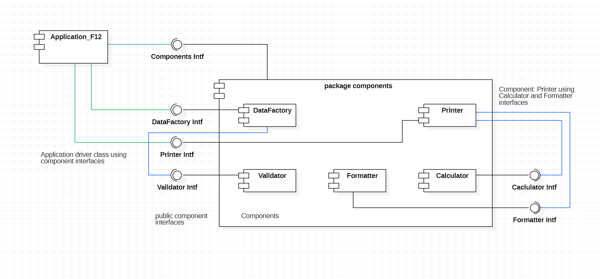
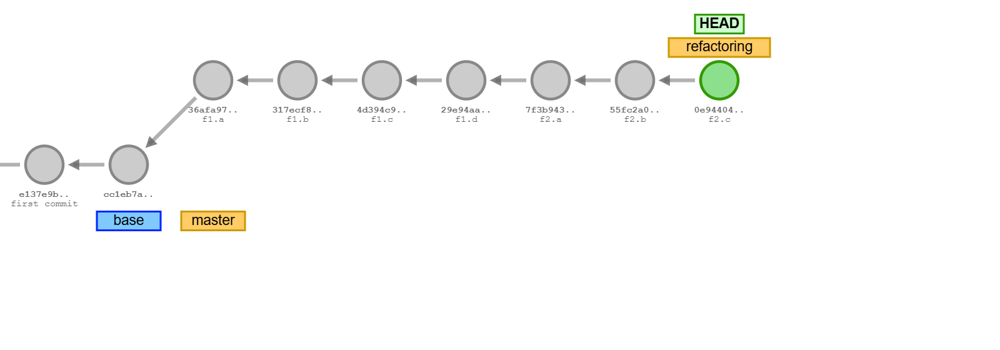
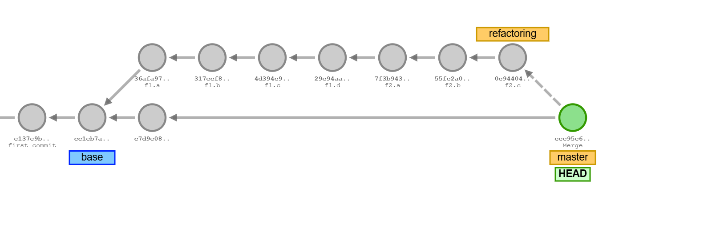
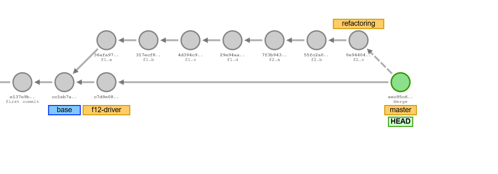
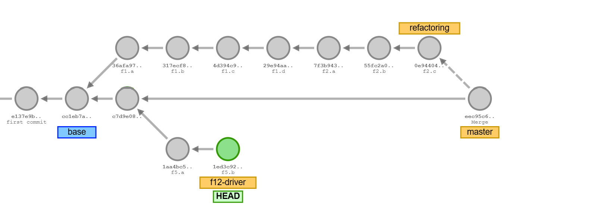
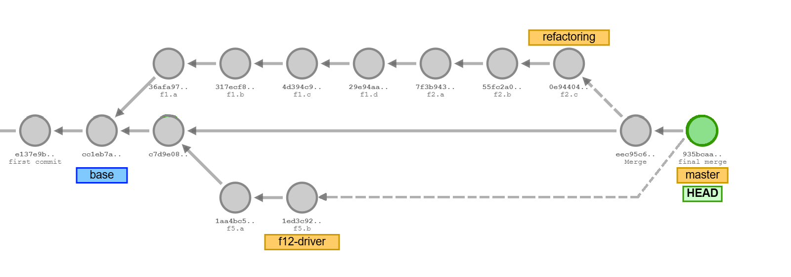
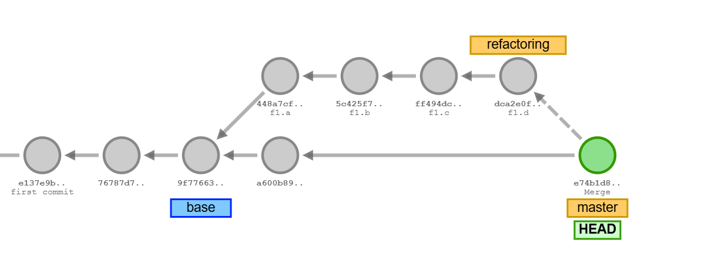

# Refactoring: *Component Architecture*

<!-- [F2: Refactoring Finish and Merge](README_F2.md)
<br>
[F3: New Driver Class: *Application_F15.java*](README_F3.md)

--- -->

<!-- 
git commit
git commit
git tag base
git checkout -b refactoring
git checkout master
git commit
git checkout refactoring
git commit -m "f1.a"
git commit -m "f1.b"
git commit -m "f1.c"
git commit -m "f1.d"
---
git checkout master
git merge refactoring
---
git checkout refactoring
git rebase master
---
git commit -m "f2.a"
git commit -m "f2.b"
git commit -m "f2.c"
---
git checkout master
git merge refactoring
---
git checkout refactoring
git rebase master
---
-->

[*Refactoring*](https://refactoring.com) is the process of *improving code
structure* without changing or creating new functionality. No new features
are added. No existing features are changed.
After *refactoring*, the same order table will be printed.

In [*Scrum*](https://www.scrum.org/resources/what-is-a-sprint-in-scrum),
software development is organized in one or two week *sprints*, either as:

- *feature sprints* which new features are developed in the existing code 
    structure - or as

- *refactoring sprints* improving the code structure without changing features.


### Problems of the Codebase

*Refactoring* should achieve clearly stated *goals*. Otherwise it is hard
to know whether code structure has improved.

The following problems have been identified in the current *se1-bestellsystem*
code base:

1. While *data model* classes (*Customer*, *Article*, *Order*, *Pricing*) are
    well organized, the code providing functionality lacks structure.

1. All functions (*calculations*, *formattings*, *printing* etc.) exist as
    methods in one *Application_XXX.java* driver classes.

1. No overall software architecture exists. Code simply grew, which
    is not good practice.


### Goals of the *Refactoring*

The following improvements are expected from the refactoring:

1. Introduction of
    [*Component-based Software Architecture (CBA)*](https://configr.medium.com/component-based-architecture-building-scalable-maintainable-software-36137d56ff46)
    to organize code as *named components*. Components exist as singleton objects
    of a class with clearly recognizable function.

    *Component-based Software Architecture* introduces patterns of *software architecture:*

    - [*Single-Responsibility Principle*](https://blog.cleancoder.com/uncle-bob/2014/05/08/SingleReponsibilityPrinciple.html)
        (Robert Martin, 2014),

    - [*Separartion of Concerns*](https://en.wikipedia.org/wiki/Separation_of_concerns)
        (Edsger W. Dijkstra, 1974) and

    - [*Information Hiding*]()
        (David Parnas, 1972)
        and [*Encapsulation*]()
        (Cox 1986, Gradcy Booch, James Rumbaugh, 1991) at the level of code modules,
        not just classes.

1. Components expose *public interfaces* while implementations are encapsulated 
    in non-public implementation classes.

1. Exposing only interfaces has advantages:

    - simplification in the code base (interfaces are much smaller than code),

    - improved clarity and recognizable structure.

    - Only refererences to interfaces are proliferated through the code base,
        not references to implementations. Interfaces are more stable and
        change less frequently than implementation code.

    - Changes in implementation classes impact fewer files, which reduces commit
        footprints.

    - Cross-references (import relations) are reduced and the *Code Quality Metric*
        of [*Coupling*](https://en.wikipedia.org/wiki/Coupling_(computer_programming))
        improves.

1. Component object creation can be centralized and references to component objects
    can be explicitly managed as *"dependencies"*, see the pattern of
    [*Dependency Injection (DI)*](https://stackoverflow.com/questions/130794/what-is-dependency-injection),
    *Martin Fowler, 2004:* *Inversion of Control Containers and the Dependency
    Injection pattern*, [*link*](https://martinfowler.com/articles/injection.html).


## *Component-based Software Architecture*

A [*UML-Component diagramm*](https://www.uml-diagrams.org/component-diagrams.html)
shows the new component-based architecture:



The diagram shows following components:

- *Calculator:* for performing price and tax calculations.

- *DataFactory:* for creating objects of datamodel classes (*Customer*, *Article*, *Order*)
    from validated parameters.

- *Validator:* for validating parameters (e.g. names, contacts, etc.), used by *DataFactory*,
    see the blue line from *DataFactory* to *Validator* (*"use"*-relation).

- *Formatter:* for formatting prices, names and contacts.

- *Printer:* for outputting collections of *Customer*, *Article*, *Order* objects
    as tables. *Printer* uses the interfaces of components: *Calculator* and *Formatter*.

- A special component holds (contains) all component objects and exposes an
    interface: *Components* with *getter* - methods providing access to components.

All components have in common:

- a ***public interface*** named after the component in a new package `components`.

- a ***non-public implementation class*** in package `components.impl` named
    after the component name appended by `Impl`.

- exist as ***singleton objects***.

For example, interface `Calculator.java` in package `components` provides the
public interface of the component. A none-public implementation class
`CalculatorImpl.java` in package `components.impl` provides the implementation
of the component.

The diagram shows the *interfaces* of all components:


---

&nbsp;

Tasks for the *refactoring* are performed by two teams, *Team A* and *Team B*
who are working on two parallel branches:

- *Team A* on branch: `main` (phases: Preparations, F3, F4)

- *Team B* on branch `refactoring` (phases: F1, F2)

In phase (F1), *Team B* will create components with public interfaces and non-public
implemenetation classes and record the development on branch *refactoring*
with commits `f1.a`, `f1.b`, `f1.c`, `f1.d`:

```
public component interfaces:
- src/components/
- src/components/Calculator.java
- src/components/Components.java
- src/components/DataFactory.java

none-public implementation classes:
- src/components/impl
- src/components/impl/CalculatorImpl.java
- src/components/impl/ComponentsImpl.java
- src/components/impl/DataFactoryImpl.java
```

In phase (F2), *Team B* will continue with remaining components: *DataFactory*,
*Formatter* and *Printer* and record results as commits: `f2.a`, `f2.b`, `f2.c`
on branch *refactoring*.

While *Team B* is busy developing components on branch *refactoring*
(phases F1, F2), *Team A* starts phase (F3) with a cleanup of the
*main* branch removing driver classes that are no longer needed.
The result is committed with message: `main.a: cleanup`.

In phase (F4), *Team B* merges the branch *refactoring* into the *main*
branch while *Team A* starts the development of a new driver Class:
*Application_F12.java* on a separate branch: `f12_driver` in phase: (F5).
This branch is merged back into the *main* branch at the end.


Steps are summarized:

*Team A* starts with:

- [Preparations](#preparations) - (below), new team members do the
    [dry-run](#dry-run).

*Team B* starts with developing components on the *refactoring* branch:

- [F1: Developing Components on Branch: *refactoring*](README_F1_components.md)

    

Meanwhile, *Team A* performs a cleanup on the main branch removing some
driver classes that are no longer needed and adjusts the javadoc version string
on the *main* branch:

- [F2: Cleanup of *main*-Branch](README_F2_cleanup_main.md)

    

While this is happening, *Team B* is making great progress developing the
remaining components on the *refactoring* branch:

- [F3: Finishing Component Development](README_F3_components.md)

*Team B* is ready and can merge the developed components from branch *refactoring*
into the *main* branch:

- [F4: Branch *Merge* and *Rebase*](README_F4_merge_and_rebase.md)

    

Meanwhile, *Team A* performs a cleanup on the main branch and 

- [F5: New Driver Class: *Application_F15.java*](README_F5_driver_class.md)

    
    
    
    
    


&nbsp;

## Preparations

Before refactoring, test the current state of the code base. Starting from a broken base
is not adviced.

Perform the three standard tests:

1. Project build.

1. Run the program.

1. Run tests.

```sh
mk clean compile compile-tests

mk run

mk run-tests
```

Program output shows the order table from the previous assignment:

```
java application.Runtime
(5) Customer objects built.
(9) Article objects built.
(7) Order objects built.
---
Bestellungen:
+----------+-------------------------------------------------+-----------------+
|Bestell-ID| Bestellungen                     MwSt*     Preis|   MwSt    Gesamt|
+----------+-------------------------------------------------+-----------------+
|8592356245| Eric's Bestellung (in EUR):                     |                 |
|          |  - 4x Teller, 4x 6.49            4.14      25.96|                 |
|          |  - 8x Becher, 8x 1.49            1.90      11.92|                 |
|          |  - 1x Buch 'UML'                 5.23*     79.95|                 |
|          |  - 4x Tasse, 4x 2.99             1.91      11.96|  13.18    129.79|
+----------+-------------------------------------------------+-----------------+
|3563561357| Anne's Bestellung (in EUR):                     |                 |
|          |  - 2x Teller, 2x 6.49            2.07      12.98|                 |
|          |  - 2x Tasse, 2x 2.99             0.95       5.98|   3.02     18.96|
+----------+-------------------------------------------------+-----------------+
|5234968294| Eric's Bestellung (in EUR):                     |                 |
|          |  - 1x Kanne                      3.19      19.99|   3.19     19.99|
+----------+-------------------------------------------------+-----------------+
|6135735635| Nadine-Ulla's Best. (EUR):                      |                 |
|          |  - 12x Teller, 12x 6.49         12.43      77.88|                 |
|          |  - 1x Buch 'Java'                3.26*     49.90|                 |
|          |  - 1x Buch 'UML'                 5.23*     79.95|  20.92    207.73|
+----------+-------------------------------------------------+-----------------+
|6173043537| Khaled Saad's Best. (EUR):                      |                 |
|          |  - 1x Buch 'Java'                3.26*     49.90|                 |
|          |  - 1x Fahrradkarte               0.45*      6.95|   3.71     56.85|
+----------+-------------------------------------------------+-----------------+
|7372561535| Eric's Bestellung (in EUR):                     |                 |
|          |  - 1x Fahrradhelm               26.98     169.00|                 |
|          |  - 1x Fahrradkarte               0.45*      6.95|  27.43    175.95|
+----------+-------------------------------------------------+-----------------+
|4450305661| Eric's Bestellung (in EUR):                     |                 |
|          |  - 3x Tasse, 3x 2.99             1.43       8.97|                 |
|          |  - 3x Becher, 3x 1.49            0.71       4.47|                 |
|          |  - 1x Kanne                      3.19      19.99|   5.33     33.43|
+----------+-------------------------------------------------+-----------------+
                                                      Gesamt:|  76.78    642.70|
                                                             +=================+
```

Tests are passing:

```
Test run finished after 487 ms
[       115 tests found           ]
[       115 tests successful      ]
[         0 tests failed          ]
```


&nbsp;

## Dry-Run

New team members who are not yet familiar with git commit, branches and merges
should do the
[*dry-run*](https://lms.bht-berlin.de/pluginfile.php/2417420/mod_resource/content/3/Ue-SE1-git-dry-run.pdf)
before starting tasks.

[*Visualizing-git*](https://git-school.github.io/visualizing-git/) is an interactive *git* - emulator
that understands simple commands to create commits, branches, tags, merges, etc.

Try for yourself creating the visual below:

```sh
help                    # show available commands
clear                   # clear pane

git commit
git commit
git tag base
git checkout -b refactoring
git checkout master
git commit
git checkout refactoring
git commit -m "f1.a"
git commit -m "f1.b"
git commit -m "f1.c"
git commit -m "f1.d"

git checkout master
git merge refactoring
...
```


