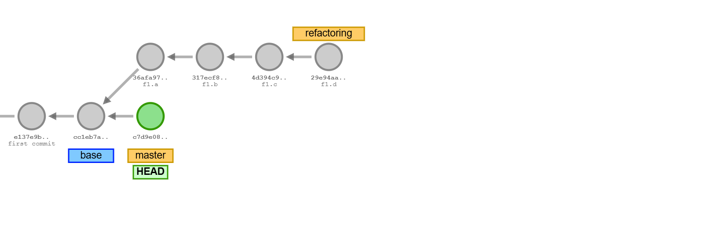

# F2: Cleanup of *main*-Branch

While *Team B* is developing components on branch *refactoring*,
*Team A* performs a cleanup on the *main* branch removing driver classes
that are no longer needed and adjusts the javadoc version string by
applying a patch.

Changes are verified and committed on branch *main* with message: 
`"main.a: clean up, version update F12"`.




Steps (Team A):

1. [Cleanup *Driver* Classes](#1-cleanup-driver-classes)
1. [Adjust *Javadoc* Version](#2-adjust-javadoc-version)
1. [Verify and Commit on Branch: *main*](#3-verify-and-commit-on-branch-main)


&nbsp;

## 1. Cleanup *Driver* Classes

Switch to the `main` branch and tag the base commit (for easier reference):

```sh
git switch main                         # switch to main
```

Remove application driver classes from previous assignments:

```sh
find {src,tests}/application            # list application driver classes
```
```
src/application/
src/application/Application.java
src/application/Application_C4.java     <-- remove
src/application/Application_D12.java    <-- remove
src/application/Application_E12.java    <-- remove
src/application/package-info.java
src/application/Runtime.java
src/tests/
tests/application/Application_0_always_pass_Tests.java
tests/application/Application_E12_Calculation_Tests.java    <-- remove
```
```sh
rm src/application/Application_*        # remove application driver classes
rm tests/application/Application_E12_Calculation_Tests.java

find {src,tests}/application            # list again
```

Application driver classes are now gone:

```
src/application/
src/application/Application.java
src/application/package-info.java
src/application/Runtime.java
src/tests/
tests/application/Application_0_always_pass_Tests.java
```


&nbsp;

## 2. Adjust *Javadoc* Version

Apply a *patch* that updates the version in `src/application/package-info.java`
to `F12-1.0.0-REFACTORING`:

```patch
diff -ruN ./src/application/package-info.java ./src/application/package-info.java
--- ./src/application/package-info.java 2025-01-12 14:01:28.088633400 +0100
+++ ./src/application/package-info.java 2025-01-12 14:02:31.799791600 +0100
@@ -22,5 +22,5 @@
     /**
      * Version attribute to appear in javadoc.
      */
-    static final String Version = "E12-1.0.0-SNAPSHOT";
+    static final String Version = "F12-1.0.0-REFACTORING";

```

Put the content above in a file: `version-update.patch`. Use the
[*patch*](https://www.geeksforgeeks.org/how-to-run-patch-command-in-linux/)
command to apply the patch. 

<!-- avoid creation of: .orig and .rej files -->
<!-- patch -s -p0 --no-backup-if-mismatch -r - < patch -->
```sh
patch -s -p0 < version-update.patch     # apply patch file

cat src/application/package-info.java   # show updated version
rm version-update.patch                 # remove patch file
```


&nbsp;

## 3. Verify and Commit on Branch: *main*

*Git* shows the differences made on the *main* branch:

```sh
git status                              # show differences on branch 'main'
```

The application driver classes have been deleted and *package-info.java*
has been patched with the new version:

```
On branch main
Changes not staged for commit:
  (use "git add/rm <file>..." to update what will be committed)
  (use "git restore <file>..." to discard changes in working directory)
        deleted:    src/application/Application_C4.java
        deleted:    src/application/Application_D12.javatar
        deleted:    src/application/Application_E12.java
        modified:   src/application/package-info.java
        deleted:    tests/application/Application_E12_Calculation_Tests.java
```

Rebuild the *main* branch and run tests:

```sh
mk clean compile compile-tests          # rebuild 'main' branch with changes
```

Run the program:

```sh
mk run                                  # run program
```

Since driver classes have been removed, the program shows the output of
*Application.java* with no tables:

```
java application.Runtime
Hello, "SE-1 Bestellsystem" (application.Application
done.
```

Run tests:

```sh
mk run-tests                            # run tests
```

```
Test run finished after 598 ms     
 ...
[       102 tests found           ]
[       102 tests successful      ]
[         0 tests failed          ]
done.
```

Commit changes on the main *branch* with message:
`"main.a: clean up, version update F12"`.

```sh
git log --oneline                       # show new commit
```
```
31004ad (HEAD -> main) main.a: clean up, version update F12
1a8a959 (tag: base) e2: tests for 100% code coverage (Article.java, Customer.java)
971ea4f e1: OrderBuilder.java implementation
...
```

The commit was recorded on the *main* branch:


