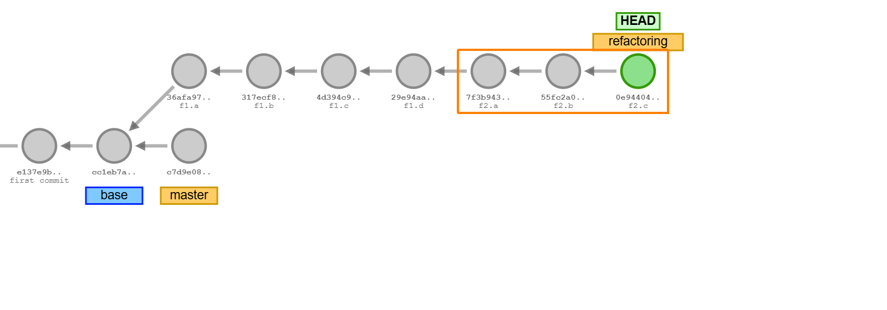

# F3: Finishing Component Development

During phase F3, Team B continues with component development recording three more
commits on the refactoring branch: `f3.a ... `, `f3.b ... ` and `f3.c ... ` on
branch *refactoring* (in the orange square).




The remaining components are:

- Component: *DataFactory* (which has been moved, but not transformed into a component
    in the prior assignment),

- Component: *Validator*,

- Component: *Formatter* and

- Component: *Printer*


Steps (Team B):

1. [Components: *DataFactory* and *Validator*](#1-components-datafactory-and-validator)
1. [Component: *Formatter*](#2-component-formatter)
1. [Component: *Printer*](#3-component-printer)
1. [Final Test, Javadoc and Commit](#4-final-test-javadoc-and-commit)


The diagram shows all component *interfaces:*


&nbsp;

## 1. Components: *DataFactory* and *Validator*

In the previous assignment, class *DataFactory* has been relocated from package `datamodel`
to package `components`. This alone did not turn *DataFactory* into a component.

The diagram shows *interfaces* of component *DataFactory* with validator methods
factored-out into a separate component interface *Validator*.
*OrderBuilder* will be integrated (part-of, composition) into *DataFactory*:


The new interfaces are added to package `components`.

1. Replace in package `components` class `DataFactory.java` with interface
    [*DataFactory.java*](f2.a/DataFactory.java) and add interface
    [*Validator.java*](f2.a/Validator.java) as shown in the diagram.

1. Move class `OrderBuilder.java` from package `components` to package `components.impl`
    and rename to `OrderBuilderImpl.java`. Use you IDE's move and rename functions.
    
    Remove `public` from the class:
    ```java
    final class OrderBuilderImpl implements DataFactory.OrderBuilder {
        ...

        @AllArgsConstructor(access=AccessLevel.PRIVATE)
        public final class BuildStateImpl implements BuildState {
            ...
            @Override
            public BuildState item(long unitsOrdered, String articleSpec) {
                ...
            }
        }
        ...

        @Override
        public Optional<Order> buildOrder(String customerSpec, Consumer<BuildState> buildState) {
            ...
        }
    }
    ```

1. Add *getter* methods to the *Components* interface:
    ```java
    public interface Components {

        /**
         * Getter of {@link DataFactory} component implementation class singleton.
         * @return reference to singleton instance of {@link DataFactory} implementation class
         */
        public DataFactory getDataFactory();

        /**
         * Getter of {@link Validator} component implementation class singleton.
         * @return reference to singleton instance of {@link Validator} implementation class
         */
        public Validator getValidator();
    }
    ```

1. Adjust `ComponentsImpl.java` by implementing the new methods. Use your IDE's auto-generate
    unimplemented methods function.
    
    Since class *DataFactoryImpl* implements both interfaces: *DataFactory* and *Validator*,
    the same *dataFactoryImpl* instance can be returned for both methods:

    ```java
    public final class ComponentsImpl implements Components {

        /**
         * singleton instance of {@link DataFactory} implementation class
         */
        private final DataFactoryImpl dataFactoryImpl;

        /**
         * Private constructor as part of the singleton pattern that creates
         * singleton instances of {@link Components} implementation classes.
         */
        private ComponentsImpl() {
            this.calculator = new CalculatorImpl();
            this.dataFactoryImpl = new DataFactoryImpl();
        }

        /**
         * Getter of {@link DataFactory} component implementation class singleton.
         * @return reference to singleton instance of {@link DataFactory} implementation class
         */
        @Override
        public DataFactory getDataFactory() {
            return dataFactoryImpl;
        }

        /**
         * Getter of {@link Validator} component implementation class singleton.
         * @return reference to singleton instance of {@link Validator} implementation class
         */
        @Override
        public Validator getValidator() {
            return dataFactoryImpl;
        }
    }
    ´´´

1. Create a new, non-public implementation class `DataFactoryImpl.java` in package
    `components.impl` that implements both interfaces: *DataFactory* and *Validator*.
    Auto-generate stubs of unimplemented methods with your IDE.

    Add a constructor that *ProtectedFactory* injects creator functions:

    ```java
    /**
    * <i>Factory</i> implementation class that implements interfaces of components:
    * {@link DataFactory} and {@link Validator}.
    */
    class DataFactoryImpl implements DataFactory, Validator {

        @Override
        public Optional<LocalDateTime> validateOrderCreationDate(LocalDateTime date) {
            // TODO Auto-generated method stub
            throw new UnsupportedOperationException("Unimplemented method 'validateOrderCreationDate'");
        }

        @Override
        public Optional<String> validateContact(String contact) {
            // TODO Auto-generated method stub
            throw new UnsupportedOperationException("Unimplemented method 'validateContact'");
        }

        /**
         * Constructor that invokes {@link ProtectedFactory} to inject creator functions
         * {@code cfc} (function for customers),
         * {@code cfo} (function for orders) and
         * {@code cfa} (function for articles).
         */
        DataFactoryImpl() {
            ProtectedFactory.inject(this, (cfc, afc, ofc) -> {
                this.customerCreator = Optional.of(cfc);
                this.articleCreator = Optional.of(afc);
                this.orderCreator = Optional.of(ofc);
            });
        }
        ...
    }
    ```

1. Fill in code from the prior class
    [*DataFactory.java*](DataFactory_prior.java) into the implementation class
    *DataFactoryImpl.java*. Make code compile.

    In order to obtain the class that has been overwritten in package `components`
    by the component interface *DataFactory.java*, one can *stash* current uncommitted
    changes and recover the class from the prior commit:

    ```sh
    git status                      # show uncommitted changes (new and modified files)
    git stash --include-untracked   # move uncommitted changes to stash
    git status                      # working tree is now clean (untracked files are ok)

    # with changes moved to the stash, the prior content is uncovered
    cp src/components/DataFactory.java src/components/impl/DataFactory_prior.java

    # the stashed content can now be restored
    git stash show          # show stashed content
    ```
    ```
    src/application/Application_C4.java                |   3 +-
    src/application/Application_D12.java               |   3 +-
    src/application/Application_E12.java               |   2 +-
    src/components/Components.java                     |  14 +-
    src/components/DataFactory.java                    | 454 ++-------------------
    src/components/OrderBuilder.java                   | 144 -------
    src/components/impl/ComponentsImpl.java            |  35 ++
    src/datamodel/Customer.java                        |   3 +-
    src/datamodel/Order.java                           |   3 +-
    tests/components/Calculator_Tests.java             |   5 +-
    .../datamodel/Article_100_FactoryCreate_Tests.java |   3 +-
    tests/datamodel/Article_200_Id_Tests.java          |   3 +-
    tests/datamodel/Article_300_Description_Tests.java |   3 +-
    tests/datamodel/Article_400_Price_Tests.java       |   4 +-
    tests/datamodel/Article_500_PriceVAT_Tests.java    |   3 +-
    .../Customer_100_FactoryCreate_Tests.java          |   9 +-
    tests/datamodel/Customer_200_Id_Tests.java         |   3 +-
    tests/datamodel/Customer_300_Name_Tests.java       |   3 +-
    tests/datamodel/Customer_400_Contacts_Tests.java   |   3 +-
    tests/datamodel/Customer_500_NameXXL_Tests.java    |   3 +-
    20 files changed, 120 insertions(+), 583 deletions(-)
    ```

    ```sh
    git stash pop           # restore stashed content
    git status              # all changes are back (hopefully :-)
    ```

    Insert content from recovered class `components.impl.DataFactory_prior.java`
    into method stubs of class `DataFactoryImpl.java`.
    Remove class `DataFactory_prior.java` after completion.

Run the code and tests. If tests are passing and the order table is printed,
commit the milestone with message:

```sh
git commit -m "f3.a refactored as components: DataFactory, Validator"
```


&nbsp;

## 2. Component: *Formatter*

Various formatting methods and class *TableFormatter* are still present in class
`Application_E12.java` as well as calculation methods.

Formatting and class *TableFormatter* are refactored into the new component: *Formatter*:


1. Design the component *Formatter* with public interface and non-public implementation
    class according to the UML class diagram.

1. Compare your interface with [*Formatter.java*](f2.b/Formatter.java) and place the
    interface into package `components`.

1. Complete the component by adding a none-public implementation class to
    package `components.impl`. Use code from `Application_E12.java` and
    `Application_D12.java` to complete methods (no new code needs to be written).

1. Add a method to interface *Components* and the corresponding method to the
    implementation class *ComponentsImpl*:

    ```java
    public interface Components {

        /**
         * Getter of {@link Formatter} component implementation class singleton.
         * @return reference to singleton instance of {@link Formatter} implementation class
         */
        public Formatter getFormatter();
    }
    ```

With these changes, code that has moved into components can be eliminated in class
`Application_E12.java`.

Install driver class [*Application_E12.java*](f2.b/Application_E12.java) in package
`application` (replacing the prior version) with formatting and calculator methods
removed (put in comments, see at the end of the file).

Fix tests, particularly *Calculator_Tests.java*.
Make adjustments such that the code compiles.

Run the code and tests. If tests are passing and code shows the order table,
commit the milestone with message:

```sh
git commit -m "f3.b refactored as component: Formatter"
```

Show the commit history of branch `refactoring`:

```sh
git log --oneline
```
```
8a200c1 (HEAD -> refactoring) f3.b refactored as component: Formatter
97dd44d f3.a refactored as components: DataFactory, Validator
859f2b5 f1.d DataFactory, OrderBuilder moved from package 'datamodel' to package 'components'
c13ee71 f1.c component tests, Component_Tests.java, Calculator_Tests.java
baade0c f1.b add Calculator component
9822c19 f1.a interface Components.java, implementation class ComponentsImpl.java
d80e2b9 (tag: base) ...                                         <-- base commit
196db11 e2: tests for 100% code coverage (Article.java, Customer.java)
dba9207 e1: OrderBuilder.java implementation                    <-- earlier commits
```


&nbsp;

## 3. Component: *Printer*

Create a new component *Printer* according to the interface specification:


Use print methods from driver class: *Application_E12.java*.

After *Printer* has been completed, remove print methods from the driver class.

Install updated driver class [*Application_E12.java*](f2.c/Application_E12.java)
in package `application` (replacing the prior version), which now also has
print methods removed (put in comments, see the end of the file).

The updated driver class prints *Customer*, *Article* price and *Order* tables.


&nbsp;

## 4. Final Test, Javadoc and Commit

Create *Javadoc* for the refactoring:

```sh
mk javadoc                              # create javadoc for the project
```

Open page `docs/index.html` in a browser and click to package `components` (or
open `docs/se1.bestellsystem/components/package-summary.html` directly)
and compare the pages with
[*Component Javadocs*](https://sgra64.github.io/se1-bestellsystem/f15-refactoring/se1.bestellsystem/components/package-summary.html).

Rebuild the project and run tests.

```sh
mk clean compile compile-tests run-tests
```
```
Test run finished after 598 ms     
 ...
[       117 tests found           ]
[       117 tests successful      ]
[         0 tests failed          ]
done.
```

Run the application to verify tables for *Customers*, *Articles* and *Orders*
print correctly:

```sh
mk run
```
```
java application.Runtime
(5) Customer objects built.
(9) Article objects built.
(7) Order objects built.
---
Kunden:
+----------+---------------------------------+---------------------------------+
| Kund.-ID | Name                            | Kontakt                         |
+----------+---------------------------------+---------------------------------+
|   286516 | Schulz-Mueller, Tim             | tim2346@gmx.de                  |
|   456454 | Abdelalim, Khaled Saad Mohamed  | +49 1524-12948210               |
|   892474 | Meyer, Eric                     | eric98@yahoo.com, (+1 contacts) |
|   412396 | Blumenfeld, Nadine-Ulla         | +49 152-92454                   |
|   643270 | Bayer, Anne                     | anne24@yahoo.de, (+2 contacts)  |
+----------+---------------------------------+---------------------------------+

Artikel (BasePricing, EUR):
+----------+---------------------------------+---------------+-----------------+
|Artikel-ID| Beschreibung                    |      Preis EUR|   MwSt.Satz     |
+----------+---------------------------------+---------------+-----------------+
|SKU-693856| Becher                          |       1.49 EUR|    19% normal   |
|SKU-638035| Teller                          |       6.49 EUR|    19% normal   |
|SKU-425378| Buch 'UML'                      |      79.95 EUR|     7% reduziert|
|SKU-300926| Pfanne                          |      49.99 EUR|    19% normal   |
|SKU-458362| Tasse                           |       2.99 EUR|    19% normal   |
|SKU-278530| Buch 'Java'                     |      49.90 EUR|     7% reduziert|
|SKU-518957| Kanne                           |      19.99 EUR|    19% normal   |
|SKU-663942| Fahrradhelm                     |     169.00 EUR|    19% normal   |
|SKU-583978| Fahrradkarte                    |       6.95 EUR|     7% reduziert|
+----------+---------------------------------+---------------+-----------------+

Artikel (BlackFridayPricing, EUR):
+----------+---------------------------------+---------------+-----------------+
|Artikel-ID| Beschreibung                    |      Preis EUR|   MwSt.Satz     |
+----------+---------------------------------+---------------+-----------------+
|SKU-693856| Becher                          |       1.19 EUR|    19% normal   |
|SKU-638035| Teller                          |       5.19 EUR|    19% normal   |
|SKU-425378| Buch 'UML'                      |      63.99 EUR|     7% reduziert|
|SKU-300926| Pfanne                          |      39.99 EUR|    19% normal   |
|SKU-458362| Tasse                           |       2.39 EUR|    19% normal   |
|SKU-278530| Buch 'Java'                     |      39.95 EUR|     7% reduziert|
|SKU-518957| Kanne                           |      15.99 EUR|    19% normal   |
|SKU-663942| Fahrradhelm                     |     135.25 EUR|    19% normal   |
|SKU-583978| Fahrradkarte                    |       5.59 EUR|     7% reduziert|
+----------+---------------------------------+---------------+-----------------+

Artikel (SwissPricing, CHF):
+----------+---------------------------------+---------------+-----------------+
|Artikel-ID| Beschreibung                    |      Preis CHF|   MwSt.Satz     |
+----------+---------------------------------+---------------+-----------------+
|SKU-693856| Becher                          |       2.69 CHF|   8.1% normal   |
|SKU-638035| Teller                          |      11.69 CHF|   8.1% normal   |
|SKU-425378| Buch 'UML'                      |     143.95 CHF|   2.6% reduziert|
|SKU-300926| Pfanne                          |      89.99 CHF|   8.1% normal   |
|SKU-458362| Tasse                           |       5.39 CHF|   8.1% normal   |
|SKU-278530| Buch 'Java'                     |      89.85 CHF|   2.6% reduziert|
|SKU-518957| Kanne                           |      35.99 CHF|   8.1% normal   |
|SKU-663942| Fahrradhelm                     |     304.25 CHF|   8.1% normal   |
|SKU-583978| Fahrradkarte                    |      12.55 CHF|   2.6% reduziert|
+----------+---------------------------------+---------------+-----------------+

Artikel (UKPricing, GBP):
+----------+---------------------------------+---------------+-----------------+
|Artikel-ID| Beschreibung                    |      Preis GBP|   MwSt.Satz     |
+----------+---------------------------------+---------------+-----------------+
|SKU-693856| Becher                          |       1.75 GBP|    20% normal   |
|SKU-638035| Teller                          |       7.49 GBP|    20% normal   |
|SKU-425378| Buch 'UML'                      |      91.95 GBP|     5% reduziert|
|SKU-300926| Pfanne                          |      57.49 GBP|    20% normal   |
|SKU-458362| Tasse                           |       3.45 GBP|    20% normal   |
|SKU-278530| Buch 'Java'                     |      57.39 GBP|     5% reduziert|
|SKU-518957| Kanne                           |      22.99 GBP|    20% normal   |
|SKU-663942| Fahrradhelm                     |     194.35 GBP|    20% normal   |
|SKU-583978| Fahrradkarte                    |       7.99 GBP|     5% reduziert|
+----------+---------------------------------+---------------+-----------------+

Bestellungen:
+----------+-------------------------------------------------+-----------------+
|Bestell-ID| Bestellungen                     MwSt*     Preis|   MwSt    Gesamt|
+----------+-------------------------------------------------+-----------------+
|8592356245| Eric's Bestellung (in EUR):                     |                 |
|          |  - 4x Teller, 4x 6.49            4.14      25.96|                 |
|          |  - 8x Becher, 8x 1.49            1.90      11.92|                 |
|          |  - 1x Buch 'UML'                 5.23*     79.95|                 |
|          |  - 4x Tasse, 4x 2.99             1.91      11.96|  13.18    129.79|
+----------+-------------------------------------------------+-----------------+
|3563561357| Anne's Bestellung (in EUR):                     |                 |
|          |  - 2x Teller, 2x 6.49            2.07      12.98|                 |
|          |  - 2x Tasse, 2x 2.99             0.95       5.98|   3.02     18.96|
+----------+-------------------------------------------------+-----------------+
|5234968294| Eric's Bestellung (in EUR):                     |                 |
|          |  - 1x Kanne                      3.19      19.99|   3.19     19.99|
+----------+-------------------------------------------------+-----------------+
|6135735635| Nadine-Ulla's Best. (EUR):                      |                 |
|          |  - 12x Teller, 12x 6.49         12.43      77.88|                 |
|          |  - 1x Buch 'Java'                3.26*     49.90|                 |
|          |  - 1x Buch 'UML'                 5.23*     79.95|  20.92    207.73|
+----------+-------------------------------------------------+-----------------+
|6173043537| Khaled Saad's Best. (EUR):                      |                 |
|          |  - 1x Buch 'Java'                3.26*     49.90|                 |
|          |  - 1x Fahrradkarte               0.45*      6.95|   3.71     56.85|
+----------+-------------------------------------------------+-----------------+
|7372561535| Eric's Bestellung (in EUR):                     |                 |
|          |  - 1x Fahrradhelm               26.98     169.00|                 |
|          |  - 1x Fahrradkarte               0.45*      6.95|  27.43    175.95|
+----------+-------------------------------------------------+-----------------+
|4450305661| Eric's Bestellung (in EUR):                     |                 |
|          |  - 3x Tasse, 3x 2.99             1.43       8.97|                 |
|          |  - 3x Becher, 3x 1.49            0.71       4.47|                 |
|          |  - 1x Kanne                      3.19      19.99|   5.33     33.43|
+----------+-------------------------------------------------+-----------------+
                                                      Gesamt:|  76.78    642.70|
                                                             +=================+
done.
```

Commit the milestone with message:

```sh
git commit -m "f3.c refactored as component: Printer"
```

Show the commit history of branch `refactoring`:

```sh
git log --oneline                       # show commit history
```

The history shows commits `f1.a` ... `f1.d` from assignment F1 and `f3.a`, `f3.b` to `f3.c`
from assignment F3.

```
722b211 (HEAD -> refactoring) f3.c refactored as component: Printer
8a200c1 f3.b refactored as component: Formatter
97dd44d f3.a refactored as components: DataFactory, Validator
859f2b5 f1.d DataFactory, OrderBuilder moved from package 'datamodel' to package 'components'
c13ee71 f1.c component tests, Component_Tests.java, Calculator_Tests.java
baade0c f1.b add Calculator component
9822c19 f1.a interface Components.java, implementation class ComponentsImpl.java
d80e2b9 (tag: base) ...                                         <-- base commit
196db11 e2: tests for 100% code coverage (Article.java, Customer.java)
dba9207 e1: OrderBuilder.java implementation                    <-- earlier commits
```

Switching to branch *main* makes refactoring changes disappear from the project
directory, which is set back to the state before the refactoring.

```sh
git switch main                         # switch to branch main

git log --oneline                       # show commit history

find src                                # list sources
```

Packages `components` and `components.impl` have disappeared.

Switch back to branch *refactoring*, rebuild the project and run the program
and tests:

```sh
git switch refactoring                  # switch back to branch refactoring

mk clean compile compile-tests          # rebuild 'main' branch with changes
mk run tests                            # run program
```

The order table is showing and tests run properly.

```sh
find src                                # 'src' contains the 'components' package

git log --oneline                       # show commit history
```
Folder `src` contains the `components` and `components.impl` packages.

The commit history on branch refactoring shows all commits made during the
refactoring:

```
722b211 (HEAD -> refactoring) f3.c refactored as component: Printer
8a200c1 f3.b refactored as component: Formatter
97dd44d f3.a refactored as components: DataFactory, Validator
859f2b5 f1.d DataFactory, OrderBuilder moved from package 'datamodel' to package 'components'
c13ee71 f1.c component tests, Component_Tests.java, Calculator_Tests.java
baade0c f1.b add Calculator component
9822c19 f1.a interface Components.java, implementation class ComponentsImpl.java
d80e2b9 (tag: base) ...                                         <-- base commit
196db11 e2: tests for 100% code coverage (Article.java, Customer.java)
dba9207 e1: OrderBuilder.java implementation                    <-- earlier commits
...
```

Visually, the commit history is:


