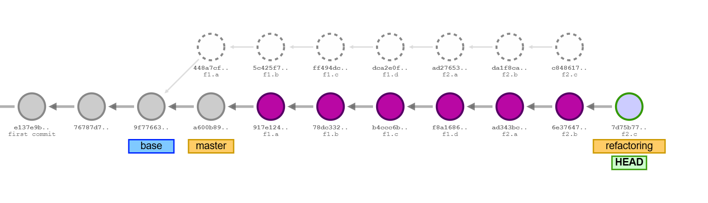

# F4: Branch *Merge* and *Rebase*

*Team B* has finished the development and can merge developed components from branch
*refactoring* into the *main* branch.


Steps (Team B):

1. [Branch *Merge* and Resolving Merge Conflicts](#1-branch-merge-and-resolving-merge-conflicts)
1. [*Rebasing* the Merge](#2-rebasing-the-merge)
1. [Alternatives to *Rebasing* a merged Branch](#3-alternatives-to-rebasing-a-merged-branch)


&nbsp;

## 1. Branch *Merge* and Resolving Merge Conflicts

Switch back to the *main* branch and run the program:

```sh
git switch main                 # switch to the main branch
git log --oneline               # show git commit history
```

The commit history on the *main* branch shows the one commit that was made for cleanup
and the version update.

```
6637350 (HEAD -> main) main.a: clean up, version update F12
d80e2b9 (tag: base) Merge branch 'dev'
196db11 e2: tests for 100% code coverage (Article.java, Customer.java)
dba9207 e1: OrderBuilder.java implementation
```

Build and run the program on the *main* branch:

```sh
mk clean compile compile-tests          # rebuild 'main' branch with changes
mk run                                  # run program
```

No order table is showing:

```
java application.Runtime
Hello, "SE-1 Bestellsystem" (application.Application)
done.
```

The source tree has no `components` package:

```sh
find src                                # 'src' has no 'components' package
```

A *classic branch merge* will merge the content of the *refactoring* branch into
the *main* branch:


```sh
git merge refactoring           # merge branch 'refactoring' into branch 'main'
```

```
CONFLICT (modify/delete): src/application/Application_C4.java deleted in HEAD and modified in refactoring.  Version refactoring of src/application/Application_C4.java left in tree.
CONFLICT (modify/delete): src/application/Application_D12.java deleted in HEAD and modified in refactoring.  Version refactoring of src/application/Application_D12.java left in tree.
CONFLICT (modify/delete): src/application/Application_E12.java deleted in HEAD and modified in refactoring.  Version refactoring of src/application/Application_E12.java left in tree.
Auto-merging src/application/package-info.java
CONFLICT (content): Merge conflict in src/application/package-info.java
CONFLICT (rename/delete): tests/application/Application_E12_Calculation_Tests.java renamed to tests/components/Calculator_Tests.java in refactoring, but deleted in HEAD.
CONFLICT (modify/delete): tests/components/Calculator_Tests.java deleted in HEAD and modified in refactoring.  Version refactoring of tests/components/Calculator_Tests.java left in tree.
Automatic merge failed; fix conflicts and then commit the result.
```

Due to merge conflicts, the merge was not *auto-committed* and is still *"open"*.
Show the *"open"* status of the merge:

```sh
git status                      # show status of merger (open)
```

The footprint (files with modifications) is quite large for the merge.
It includes all commits made on the *refactoring* branch:

```
On branch main
You have unmerged paths.
  (fix conflicts and run "git commit")
  (use "git merge --abort" to abort the merge)

Changes to be committed:
    new file:   src/components/Calculator.java
    new file:   src/components/Components.java
    new file:   src/components/DataFactory.java
    new file:   src/components/Formatter.java
    new file:   src/components/Printer.java
    new file:   src/components/Validator.java
    new file:   src/components/impl/CalculatorImpl.java
    new file:   src/components/impl/ComponentsImpl.java
    renamed:    src/datamodel/DataFactory.java -> src/components/impl/DataFactoryImpl.java
    new file:   src/components/impl/FormatterImpl.java
    renamed:    src/datamodel/OrderBuilder.java -> src/components/impl/OrderBuilderImpl.java
    new file:   src/components/impl/PrinterImpl.java
    new file:   src/components/impl/TableFormatterImpl.java
    modified:   src/datamodel/Article.java
    modified:   src/datamodel/Customer.java
    modified:   src/datamodel/Order.java
    new file:   src/datamodel/ProtectedFactory.java
    modified:   src/module-info.java
    new file:   tests/components/Component_Tests.java
    modified:   tests/datamodel/Article_100_FactoryCreate_Tests.java
    modified:   tests/datamodel/Article_200_Id_Tests.java
    modified:   tests/datamodel/Article_300_Description_Tests.java
    modified:   tests/datamodel/Article_400_Price_Tests.java
    modified:   tests/datamodel/Article_500_PriceVAT_Tests.java
    modified:   tests/datamodel/Customer_100_FactoryCreate_Tests.java
    modified:   tests/datamodel/Customer_200_Id_Tests.java
    modified:   tests/datamodel/Customer_300_Name_Tests.java
    modified:   tests/datamodel/Customer_400_Contacts_Tests.java
    modified:   tests/datamodel/Customer_500_NameXXL_Tests.java
```

Merge conflicts are shown under *"Unmerged paths" :*

```
Unmerged paths:
  (use "git add/rm <file>..." as appropriate to mark resolution)
    deleted by us:   src/application/Application_C4.java
    deleted by us:   src/application/Application_D12.java
    deleted by us:   src/application/Application_E12.java
    both modified:   src/application/package-info.java
    deleted by us:   tests/components/Calculator_Tests.java
```

At this point, the merge is *"open"*.
An *"open"* merge can always be reset:

```sh
git merge --abort               # cancel merge, discard changes, restore from the previous commit

git status                      # status is reset to the previous commit
```

Cancel the merge. The status will be clean again.

Re-apply the merge. Merge conflicts are back and refer to the deleted files
(driver classes that have been deleted on the *main* branch, but are still
present on the *refactoring* branch).

Remove drivers from the merged changes, but keep `Calculator_Tests.java`:

```sh
# remove files (again) as part of conflict resolution
git rm src/application/Application_C4.java
git rm src/application/Application_D12.java
git rm src/application/Application_E12.java

git add tests/components/Calculator_Tests.java
```

There is one modification: *"both modified"* shown under *"Unmerged paths"*
for file: `src/application/package-info.java`.
Resolve this conflict with the IDE accepting the *"current state"* (not the
incoming).

Before committing the merge, make sure the project builds and runs with
no errors:

```sh
mk clean compile compile-tests      # clean rebuild of the project

mk run-tests                        # run tests
```
```
Test run finished after 1049 ms
[       117 tests found           ]
[       117 tests successful      ]
[         0 tests failed          ]
done.
```

Run the program:

```sh
mk run                          # run program
```

Driver classes have been removed. The default driver runs:

```
java application.Runtime 
Hello, "SE-1 Bestellsystem" (application.Application)
done.
```

This is the desired behavior of the merge at this stage.

Verify files that become part of the merge commit:

```sh
find src tests                  # show files under 'src' and 'tests'
```
```
src:
src/application
src/application/Application.java                <-- other driver classes gone
src/application/package-info.java
src/application/Runtime.java
src/components                                  <-- new 'components' package
src/components/Calculator.java
src/components/Components.java
src/components/DataFactory.java
src/components/Formatter.java
src/components/impl
src/components/impl/CalculatorImpl.java
src/components/impl/ComponentsImpl.java
src/components/impl/DataFactoryImpl.java
src/components/impl/FormatterImpl.java
src/components/impl/OrderBuilderImpl.java
src/components/impl/PrinterImpl.java
src/components/impl/TableFormatterImpl.java
src/components/Printer.java
src/components/Validator.java
src/datamodel                                   <-- no DataFactory.java, OrderBuilder.java
src/datamodel/Article.java                          under 'datamodel'
src/datamodel/Customer.java
src/datamodel/Order.java
src/datamodel/package-info.java
src/datamodel/Pricing.java
src/datamodel/ProtectedFactory.java
src/module-info.java

tests:
tests/application
tests/application/Application_0_always_pass_Tests.java
tests/components
tests/components/Calculator_Tests.java          <-- new test
tests/components/Component_Tests.java           <-- new test
tests/datamodel
tests/datamodel/Article_100_ConstructorCoverage_Tests.java
tests/datamodel/Article_100_FactoryCreate_Tests.java
tests/datamodel/Article_200_Id_Tests.java
tests/datamodel/Article_300_Description_Tests.java
tests/datamodel/Article_400_Price_Tests.java
tests/datamodel/Article_500_PriceVAT_Tests.java
tests/datamodel/Customer_100_ConstructorCoverage_Tests.java
tests/datamodel/Customer_100_FactoryCreate_Tests.java
tests/datamodel/Customer_200_Id_Tests.java
tests/datamodel/Customer_300_Name_Tests.java
tests/datamodel/Customer_400_Contacts_Tests.java
tests/datamodel/Customer_500_NameXXL_Tests.java
```

Changes of the *"open"* merge can now be committed. The commit closes the
merge.


```sh
git add .                       # stage resolved conflicts

# commit the merge
git commit -m "main.b: merge branch refactoring"

git status                      # status is clean again
git log --oneline               # show the new merge commit on the 'main' branch
```

`HEAD` points at the new merge commit on the *main* branch:

```
929d7cf (HEAD -> main) main.b: merge branch refactoring         <-- new merge commit on 'main' branch
722b211 (refactoring) f3.c refactored as component: Printer     <-- pointer of 'refactoring' branch
8a200c1 f3.b refactored as component: Formatter
97dd44d f3.a refactored as components: DataFactory, Validator
6637350 main.a: clean up, version update F12                    <-- prior commit on 'main' branch
859f3b5 f1.d DataFactory, OrderBuilder moved from package 'datamodel' to package 'components'
c13ee71 f1.c component tests, Component_Tests.java, Calculator_Tests.java
baade0c f1.b add Calculator component
9822c19 f1.a interface Components.java, implementation class ComponentsImpl.java
//
d80e2b9 (tag: base) ...                                         <-- base commit
196db11 e2: tests for 100% code coverage (Article.java, Customer.java)
dba9207 e1: OrderBuilder.java implementation                    <-- earlier commits
...
```


&nbsp;

## 2. *Rebasing* the Merge

The *git log* shows that all commits from the refactoring branch (since its *"base"*)
have been inserted into the main branch preserving the *"entire history"* (all commits
also from branch refactoring).

Logically, one would exect only one merge-commit created on the *main* branch containing
the result of the *refactoring* branch:


In reality, *all commits* of the *refactoring* branch have been inserted into
the *main* branch:



The reason for this behavior is that *git* preserves the entire history of commits
by default.

If we wanted to summarize the result on the *refactoring* branch and also
what we changed on the *main* branch in only one commit, we can *rebase*
the current state of the development (the *merge commit*) back to the commit
tagged as *"base"* (blue marker in the figure) collapsing all commits inherited
from the refactoring merge into one commit: `main.b: merge branch refactoring (rebased)`

*Rebase* is a complex *git* operation that can be used for many purposes:

1. Change the commit message (*"amend"*).

1. Relocate a commit or a commit sequence from its prior predecessor
    to another commit.

1. Drop and combine commits (*drop*, *squash*, *fixup*).

*Rebase* is one of the ways to alter the commit sequences recorded on branches.
This is called *"rewriting history"*.

*Rebase* is a complex *git* operation that in most cases requires interactive
support:

```sh
tar cvf  git-post-merge.tar     # create backup of the local .git repository after the merge

# interactive process to rebase the merge commit back to the prior 'base' commit
git rebase -i "base"
```

The *vim* editor opens showing the commits affected by the *rebase* command.

```
pick 6637350 main.a: clean up, version update F12
pick 9822c19 f1.a interface Components.java, implementation class ComponentsImpl.java
pick baade0c f1.b add Calculator component
pick c13ee71 f1.c component tests, Component_Tests.java, Calculator_Tests.java
pick 859f2b5 f1.d DataFactory, OrderBuilder moved from package 'datamodel' to package 'components'
pick 97dd44d f3.a refactored as components: DataFactory, Validator
pick 8a200c1 f3.b refactored as component: Formatter
pick 722b211 f3.c refactored as component: Printer

# Rebase 1a8a959..f0db915 onto 1a8a959 (8 commands)
#
# Commands:
# p, pick <commit> = use commit
# r, reword <commit> = use commit, but edit the commit message
# e, edit <commit> = use commit, but stop for amending
# s, squash <commit> = use commit, but meld into previous commit
# f, fixup [-C | -c] <commit> = like "squash" but keep only the previous
#                    commit's log message, unless -C is used, in which case
#                    keep only this commit's message; -c is same as -C but
#                    opens the editor
# 
# x, exec <command> = run command (the rest of the line) using shell
# b, break = stop here (continue rebase later with 'git rebase --continue')
# d, drop <commit> = remove commit
# l, label <label> = label current HEAD with a name
# t, reset <label> = reset HEAD to a label
# m, merge [-C <commit> | -c <commit>] <label> [# <oneline>]
#         create a merge commit using the original merge commit's
#         message (or the oneline, if no original merge commit was
#         specified); use -c <commit> to reword the commit message
# u, update-ref <ref> = track a placeholder for the <ref> to be updated
#                       to this position in the new commits. The <ref> is
#                       updated at the end of the rebase
```

*Rebase* allows fine grained control over recorded commits. Commits are listed at the
top preceeded by a command that will be applied to the commit. Commands are executed
from the top down.

Commands that can be executed for each listed commit are:

- *"pick"* means to carry the commit over in the resulting commit sequence.

- *"reword"*, *"edit"* are used to change commit messages.

- *"drop"* the commit and factor its content into the previous commit
    (the commit above in the list)

- *"fixup"*, *"squash"* are used to merge changes of the commit into the
    previous commit (the commit above in the list).

Use [*vim*](https://coderwall.com/p/adv71w/basic-vim-commands-for-getting-started)
editor commands to pick the first commit and meld (fix) the remaining commits into
it.

The commands for consolidating the commits inherited from merging the *refactoring*
branch are:

- *"reword"* pick the first (top) commit with changed commit message:
    `main.b: merge branch refactoring (rebased)`.

- *"squash"* the next 3 commits merging them one by one into the previous commit.

- *"drop"* removes a commit. Changes (`A` - additions or `D` - deletions) are lost.
    Modifications are reactored from the previous commit.

Edit the command sequence (mind commands and the reworded commit message):

```
reword 50a5db4 main.a: clean up, version update F15
fixup 042569f f1.a interface Components.java, implementation class ComponentsImpl.java
fixup 8c1e2d1 f1.b add Calculator component
fixup b8b513d f1.c component tests, Component_Tests.java, Calculator_Tests.java
fixup 5ddacaf f1.d DataFactory, OrderBuilder moved from package 'datamodel' to package 'components'
fixup 33e15ea f3.a refactored as components: DataFactory, Validator
fixup 023002a f3.b refactored as component: Formatter
fixup e7b81be f3.c refactored as component: Printer
```

Press `ESC` to return the command mode and `:wq`, which saves the changes (`w` for write)
and quits vim (`q`).

*Rebase* enters mode: `interactive rebase in progress` and begins executing commands.
It picks the first commit and opens the editor for the new commit message.
Enter: `main.b: merge refactoring (rebased)` and leave the editor (`:wq`).

The next command in the sequence is *squash*, which merges the commit into the
previous commit. This causes conflicts:

```
[detached HEAD c453bf1] main.b: merge refactoring (rebased)
 Date: Tue Jan 21 18:32:56 2025 +0100
 6 files changed, 34 insertions(+), 1847 deletions(-)
 delete mode 100644 src/application/Application_C4.java
 delete mode 100644 src/application/Application_D12.java
 delete mode 100644 src/application/Application_E12.java
 create mode 100644 src/application/package-info.java.orig
 delete mode 100644 tests/application/Application_E12_Calculation_Tests.java
Auto-merging src/application/package-info.java
CONFLICT (content): Merge conflict in src/application/package-info.java
error: could not apply 9822c19... f1.a interface Components.java, implementation
 class ComponentsImpl.java
hint: Resolve all conflicts manually, mark them as resolved with
hint: "git add/rm <conflicted_files>", then run "git rebase --continue".
hint: You can instead skip this commit: run "git rebase --skip".
hint: To abort and get back to the state before "git rebase", run "git rebase --
abort".
Could not apply 9822c19... f1.a interface Components.java, implementation class
ComponentsImpl.java
```

Conflicts are resolved in the same way as for merges: resolve, make sure everything works,
commit.


### Resolve Conflict: *"f1.b add Calculator component"*

To see conflicts:

```sh
git status              # show conflicts as 'Unmerged paths'
```

Look for red lines in *"Unmerged paths"*.

```
interactive rebase in progress; onto 1a8a959
...
deleted by us:   src/application/Application_E12.java
both modified:   src/application/package-info.java 
```

Lines refer to the version update in `package-info.java` and the removal
of the driver class. Resolve the conflict in `package-info.java`
(use the current version: *"F15-1.0.0-REFACTORING"*) and stage:

```sh
git add src/application/package-info.java       # stage the resolved conflict

git status                          # check no more red lines are present

git rebase --continue               # continue rebasing
```

*Vim* editor opens showing currently recorded commits with messages:

```
# This is a combination of 3 commits.
# This is the 1st commit message:

main.b: merge refactoring (rebased)         <-- change, if this is not the message

# The commit message #2 will be skipped:
# f1.a interface Components.java, implementation class ComponentsImpl.java
...
```

Leave *vim* (`:wq`). Processing rebase commands continues.

Conflicts are reported also for the second *squash* regarding new component tests
that came with the refactoring merge:

```
Could not apply b8b513d... f1.c component tests, Component_Tests.java, Calculator_Tests.java
```


### Resolve Conflict: *"f1.c component tests, Component_Tests.java, Calculator_Tests.java"*

Check *git status* looking for red lines, resolve and resume rebasing:

```sh
git status
```
```
deleted by us:   tests/components/Calculator_Tests.java 
```

Resolve by including *Calculator_Tests.java* into the commit:

```sh
# accept the new component test
git add tests/components/Calculator_Tests.java

git status                  # check no more red lines are present

git rebase --continue       # continue rebasing
```

Conflicts are reported:

```
Could not apply 5ddacaf... f1.d DataFactory, OrderBuilder moved from package 'datamodel' to package 'components'
```


### Resolve Conflict: *"f1.d DataFactory, OrderBuilder moved from package 'datamodel' to package 'components'"*

Check *git status* looking for red lines, resolve and resume rebasing:

```sh
git status
```
```
deleted by us:   src/application/Application_C4.java
deleted by us:   src/application/Application_D12.java
deleted by us:   src/application/Application_E12.java
```

Resolve conflicts accepting the deletion of driver classes:

```sh
# accept removed driver classes
git rm src/application/Application_C4.java
git rm src/application/Application_D12.java
git rm src/application/Application_E12.java

git status                  # check no more red lines are present

git rebase --continue       # continue rebasing
```

Conflicts are reported:

```
error: could not apply 33e15ea... f3.a refactored as components: DataFactory, Validator
```


### Resolve Conflict: *"f3.a refactored as components: DataFactory, Validator"*

Check *git status* looking for red lines, resolve and resume rebasing:

```sh
git status
```
```
deleted by us:   src/application/Application_C4.java
deleted by us:   src/application/Application_D12.java
deleted by us:   src/application/Application_E12.java
```

Resolve conflicts accepting the deletion of driver classes:

```sh
# accept removed driver classes
git rm src/application/Application_C4.java
git rm src/application/Application_D12.java
git rm src/application/Application_E12.java

git status                  # check no more red lines are present

git rebase --continue       # continue rebasing
```

Conflicts are reported:

```
error: could not apply 023002a... f3.b refactored as component: Formatter
```


### Resolve Conflict: *"f3.b refactored as component: Formatter"*

Check *git status* looking for red lines, resolve and resume rebasing:

```sh
git status
```
```
deleted by us:   src/application/Application_E12.java
```

Resolve conflicts accepting the deletion of the driver class:

```sh
# accept removed driver class
git rm src/application/Application_E12.java

git status                  # check no more red lines are present

git rebase --continue       # continue rebasing
```

Conflicts are reported:

```
Could not apply e7b81be... f3.c refactored as component: Printer
```


### Resolve Conflict: *"f3.c refactored as component: Printer"*

Check *git status* looking for red lines, resolve and resume rebasing:

```sh
git status
```
```
deleted by us:   src/application/Application_E12.java
```

Resolve conflicts accepting the deletion of the driver class:

```sh
# accept removed driver class
git rm src/application/Application_E12.java

git status                  # check no more red lines are present

git rebase --continue       # continue rebasing
```

Rebase completes with success:

```
[detached HEAD 9a8b0ed] main.b: merge refactoring (rebased)
 Date: Tue Jan 21 18:32:56 2025 +0100
 34 files changed, 1495 insertions(+), 1485 deletions(-)
 delete mode 100644 src/application/Application_C4.java
 delete mode 100644 src/application/Application_D12.java
 delete mode 100644 src/application/Application_E12.java
 create mode 100644 src/components/Calculator.java
 create mode 100644 src/components/Components.java
 create mode 100644 src/components/DataFactory.java
 create mode 100644 src/components/Formatter.java
 create mode 100644 src/components/Printer.java
 create mode 100644 src/components/Validator.java
 create mode 100644 src/components/impl/CalculatorImpl.java
 create mode 100644 src/components/impl/ComponentsImpl.java
 rename src/{datamodel/DataFactory.java => components/impl/DataFactoryImpl.java} (88%)
 create mode 100644 src/components/impl/FormatterImpl.java
 rename src/{datamodel/OrderBuilder.java => components/impl/OrderBuilderImpl.java} (87%)
 create mode 100644 src/components/impl/PrinterImpl.java
 create mode 100644 src/components/impl/TableFormatterImpl.java
 create mode 100644 src/datamodel/ProtectedFactory.java
 rename tests/{application/Application_E12_Calculation_Tests.java => components/Calculator_Tests.java} (98%)
 create mode 100644 tests/components/Component_Tests.java
Successfully rebased and updated refs/heads/main.
```

The status is no longer *"interactive rebase in progress":*

```sh
git status                      # show git status
```
```
On branch main
nothing to commit, working tree clean
```

The commit history of branch *main* shows the new commit following the
commit of the *"base tag"*. All commits inherited with the merge of branch
*refactoring* have been combined into the picked commmit, which appears
with the altered commit message:
`main.b: merge branch refactoring (rebased)`:

```sh
git log --oneline               # show commit history
```
```
9a8b0ed (HEAD -> main) main.b: merge refactoring (rebased)      <-- combined commit
//
1a8a959 (tag: base) ...                                         <-- base commit
f3f933b e2: tests for 100% code coverage (Article.java, Customer.java)
971ea4f e1: OrderBuilder.java implementation                    <-- earlier commits
...
```

Verify that all expected files from `src` and `tests` are in this commit:

```sh
find src tests                  # show files under 'src' and 'tests'
```
```
src:
src/application
src/application/Application.java                <-- other driver classes gone
src/application/package-info.java
src/application/Runtime.java
src/components                                  <-- new 'components' package
src/components/Calculator.java
src/components/Components.java
src/components/DataFactory.java
src/components/Formatter.java
src/components/impl
src/components/impl/CalculatorImpl.java
src/components/impl/ComponentsImpl.java
src/components/impl/DataFactoryImpl.java
src/components/impl/FormatterImpl.java
src/components/impl/OrderBuilderImpl.java
src/components/impl/PrinterImpl.java
src/components/impl/TableFormatterImpl.java
src/components/Printer.java
src/components/Validator.java
src/datamodel                                   <-- no DataFactory.java, OrderBuilder.java
src/datamodel/Article.java                          in 'datamodel'
src/datamodel/Customer.java
src/datamodel/Order.java
src/datamodel/package-info.java
src/datamodel/Pricing.java
src/datamodel/ProtectedFactory.java
src/module-info.java

tests:
tests/application
tests/application/Application_0_always_pass_Tests.java
tests/components
tests/components/Calculator_Tests.java          <-- new test is present
tests/components/Component_Tests.java           <-- new test is present
tests/datamodel
tests/datamodel/Article_100_ConstructorCoverage_Tests.java
tests/datamodel/Article_100_FactoryCreate_Tests.java
tests/datamodel/Article_200_Id_Tests.java
tests/datamodel/Article_300_Description_Tests.java
tests/datamodel/Article_400_Price_Tests.java
tests/datamodel/Article_500_PriceVAT_Tests.java
tests/datamodel/Customer_100_ConstructorCoverage_Tests.java
tests/datamodel/Customer_100_FactoryCreate_Tests.java
tests/datamodel/Customer_200_Id_Tests.java
tests/datamodel/Customer_300_Name_Tests.java
tests/datamodel/Customer_400_Contacts_Tests.java
tests/datamodel/Customer_500_NameXXL_Tests.java
```

Compare the file list with results of
[*refactoring-post-merge-files.txt*](refactoring-post-merge-files.txt).

```sh
url="https://raw.githubusercontent.com/sgra64/se1-bestellsystem/refs/heads/markup/f15-refactoring/refactoring-post-merge-files.txt"

curl -L -o refactoring-post-merge-files.txt "$url"      # download file: 'refactoring-post-merge-files.txt'
```

An alternative for downloading the file is: `wget "$url"`.

Compare the status of your files from `src` and `tests` after rebasing the merged branch:

```sh
find src tests | diff refactoring-post-merge-files.txt -
```

Output should be empty (no difference).

Make sure the project builds and runs with no errors after the rebase:

```sh
mk clean compile compile-tests      # clean rebuild of the project

mk run-tests                        # run tests
```
```
Test run finished after 1049 ms
[       117 tests found           ]
[       117 tests successful      ]
[         0 tests failed          ]
done.
```

Run the program:

```sh
mk run                              # run the program
```

Driver classes have been removed. The default driver only runs:

```
java application.Runtime 
Hello, "SE-1 Bestellsystem" (application.Application)
done.
```

The commit containing the result of the *refactoring* branch has been created
on the *main* branch:


&nbsp;

## 3. Alternatives to *Rebasing* a merged Branch

### Alternative 1: *git reset*

Purpose of *rebasing* the merged branch *refactoring* was to eliminate its commits
from the the commit history of the *main* branch.

The same can be achieved by a *"soft-reset"* of the *HEAD* pointer back to the
"*base*" commit.

In this case, the difference between the *HEAD* commit and the *"base"* commit is
determind and represented as modifications in the *working tree* (in the project
directory) compared the "*base*" commit.

The *reset* trims the commit history back to the *"base"* commit.
Changes represented in the working tree can then simply be committed.

```sh
git reset base              # reset HEAD to the 'base' commit creating the difference as
                            # changes in the working tree

git status                  # changes appear as modifications in the working tree

find src tests              # verify 'components' are there and drivers 'Application_*.java' are gone

mk clean compile compile-tests      # make sure clean build works
mk run run-tests                    # make sure the program and tests run

git add .                           # stage and commit changes
git commit -m "main.b: merge branch refactoring (after reset)"

git log --oneline                   # show the commit history
```
```
6593e7e (HEAD -> main) main.b: merge branch refactoring (after reset)
//
1a8a959 (tag: base) ...                                         <-- base commit
f3f933b e2: tests for 100% code coverage (Article.java, Customer.java)
971ea4f e1: OrderBuilder.java implementation                    <-- earlier commits
...
```

The commit history shows the same result as after rebasing.


&nbsp;

### Alternative 2: *git merge --squash*

Steps of merging branches with inheriting commits from the merged branch and resetting
the merged result to a base can also be summarized by a *"squashed merge":*

```sh
git merge --squash refactoring      # merge branch 'refactoring' into 'main' with squashing
                                    # incoming commits into one resulting merge commit
```

The merge will report the same merge-conficts as the initial merge of the refactoring branch.

After resolving conflicts, the merge can be committed:

```sh
git commit -m "main.b: merge branch refactoring (squash merge)"

git log --oneline                   # show the commit history
```

The squashed merge only affects (squashes) the incoming commits, which is
a difference to the other methods shown above.

```
6593e7e (HEAD -> main) main.b: merge branch refactoring (squashed merge)
c0e6b21 main.a: clean up, version update F15         <-- prior commit on 'main' remains
//
1a8a959 (tag: base) ...                                         <-- base commit
f3f933b e2: tests for 100% code coverage (Article.java, Customer.java)
971ea4f e1: OrderBuilder.java implementation                    <-- earlier commits
...
```
